# Procesverslag
Markdown is een simpele manier om HTML te schrijven.  
Markdown cheat cheet: [Hulp bij het schrijven van Markdown](https://github.com/adam-p/markdown-here/wiki/Markdown-Cheatsheet).

Nb. De standaardstructuur en de spartaanse opmaak van de README.md zijn helemaal prima. Het gaat om de inhoud van je procesverslag. Besteedt de tijd voor pracht en praal aan je website.

Nb. Door *open* toe te voegen aan een *details* element kun je deze standaard open zetten. Fijn om dat steeds voor de relevante stuk(ken) te doen.

## Jij

### Ontwerper:
Merel Timmer

#### Je startniveau:
Mijn startniveau is: blauw

# Je plan

  
De eerste versie/schets van je ontwerp & je persoonlijke uitdaging

  ### De eerste versie/schets:
  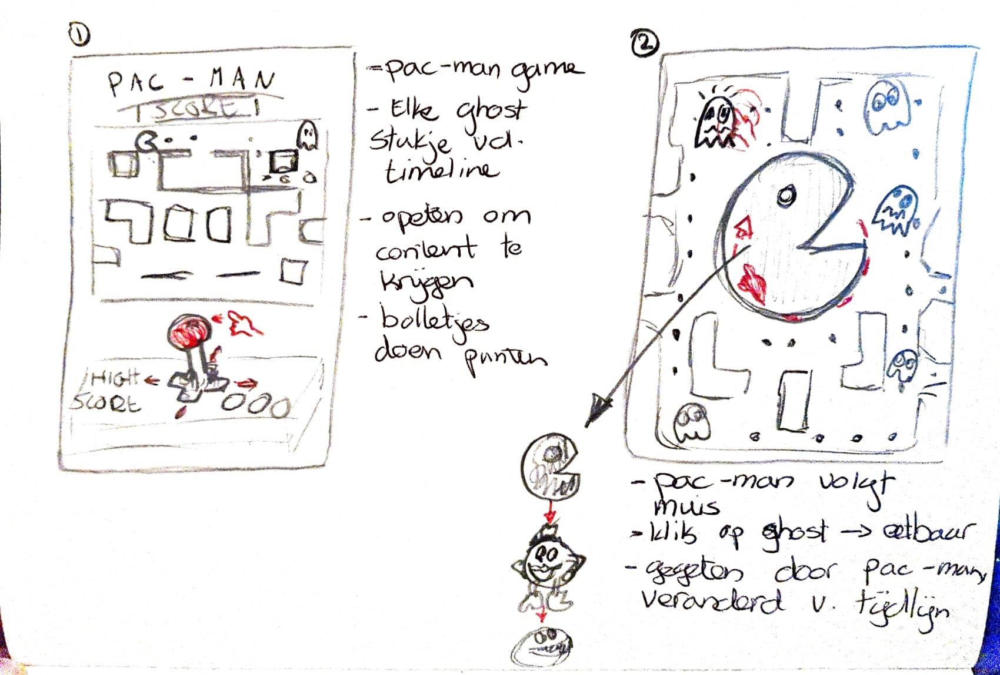
  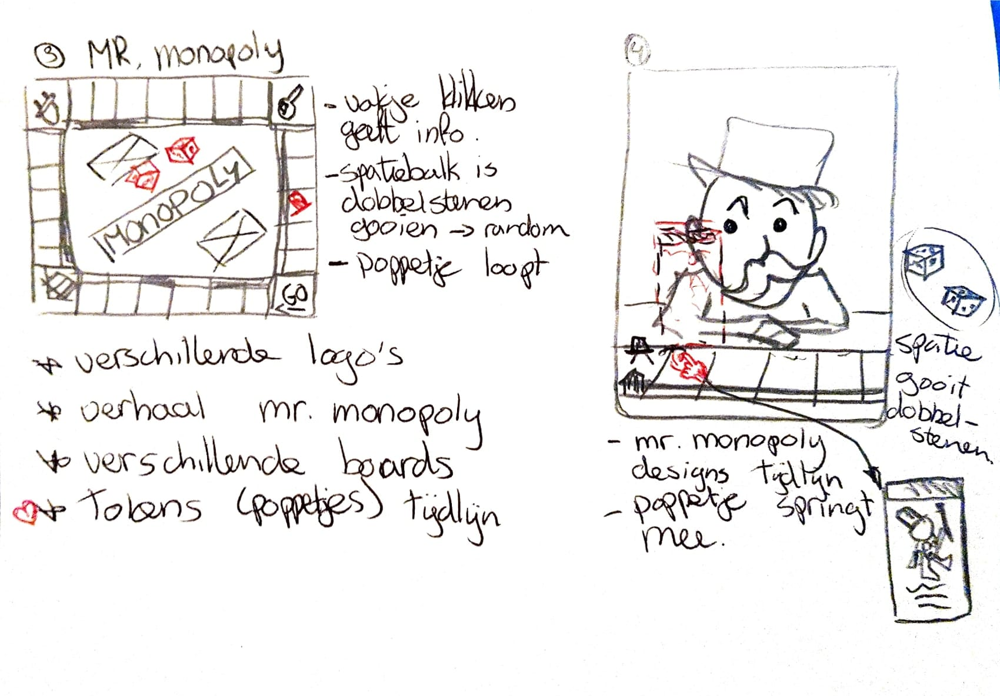
  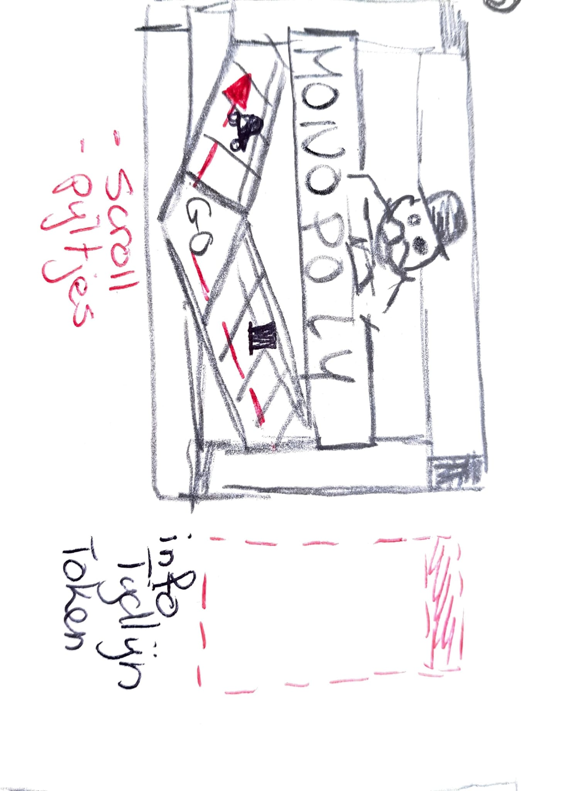
  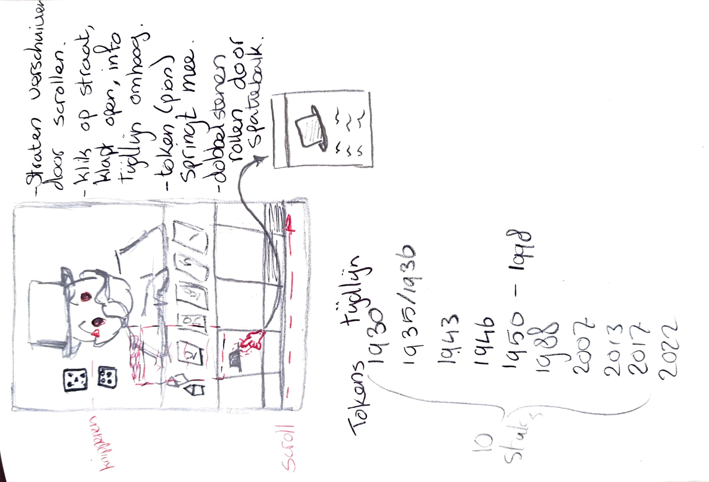

  Ik wilde liever een eigen karakter kiezen dan één van de voorgestelde karakters uit de eerste les om zo de tijdlijn echt een eigen werk te maken. Juist het bedenken van concepten vind ik erg leuk waardoor ik graag de vrijheid hiervan wilde gebruiken. Tijdens de eerste les was ik aan het brainstormen over PAC-MAN waar ik al een leuk idee voor had bedacht. Maar toen ik richting huis ging liep ik even snel de Intertoys in om te kijken of ik daar wat iconische karakters tegen zou komen. Zo kwam ik Rich Uncle Pennybags tegen, oftewel de 'Monopoly guy'. Monopoly is een spel wat ik heel graag speel en zelfs meerdere versies van in huis heb liggen. Ik ben verder gaan brainstormen over dit karakter en heb er meerdere schetsen voor gemaakt. Uiteindelijk heb ik gekozen voor een ontwerp waardoor het lijkt alsof je een potje Monopoly tegen Rich Uncle Pennybags speelt, en waar de straten van het speelbord de uiteindelijke tijdlijn is.

  ### Je ambitie: 
  Aan deze technieken/punten wil ik werken:
  - Het begrijpen van coderen in het algemeen.
  - Werken aan mijn netheid en leesbaarheid van code.
  - Werken met interactie en animatie in code.
  - Kunnen begrijpen hoe code met elkaar samenwerkt.
 

## Voortgang/Feedback 1

  
Mijn bevindingen + wijzigingen (minimaal 5)

  ### Bevinding 1:
  Als feedback kreeg ik eigenlijk wel mee dat het een origineel idee was en passend voor de tijdlijn. Ik twijfelde nog het bij het ontwerp voor de tijdlijn tussen de designs van Rich Uncle Pennybags of een tijdlijn over alle pionnetjes die het originele spel heeft gebruikt. Het laatste idee vonden meerdere studenten origineler en leuker klinken dan de designs. Hier was ik het ook mee eens waardoor mijn keuze daarvoor is gevallen. Als verdere feedback kreeg ik nog leuke ideeën over easter eggs en andere kleine details. Zo kreeg ik inspiratie voor bijvoorbeeld een vakje 'gevangenis' waarbij er dan tralies naar beneden zouden vallen, of dat ik de ogen van Rich Uncle Pennybags zou kunnen laten knipperen.  

  Veel heb ik dus niet aan mijn ontwerp aangepast. Ik heb de ideeën die ik door de feedback heb gekregen opgeschreven zodat ik ze niet vergeet, maar ik wil me daar in het begin nog niet te veel mee bezig houden. Het lijkt me voor mij handiger en belangrijker om te kijken hoe ver ik kom met coderen en wat ik allemaal kan toepassen. Zo kan ik altijd mijn verwachtingen bijstellen en beetje bij beetje mijn ontwerp uitbreiden tot mijn niveau.

  ### Bevinding 2:
  Het opstarten ging een beetje moeizaam aangezien ik niet goed wist waar ik moest beginnen. Zo vond ik het lastig om te bepalen welke elementen ik allemaal nodig had en waar dat allemaal moest komen te staan in de HTML. Zeker toen ik in het begin alleen een wit scherm met een lijst zag staan kon ik niet voor me zien hoe ik hier iets van moest maken. 
    
  #### oplossing:
  Aangezien ik nog nooit met HTML heb gewerkt kreeg ik de tip om de HTML-course op DLO te volgen. Dit heb ik dezelfde middag nog gedaan en het heeft mij wel geholpen met het opzetten van de webpagina. Ik begreep vooral meer over hoe ik het ontwerp moest ontleden in verschillende onderdelen en welk onderdeel dan waar in de HTML moest. 
  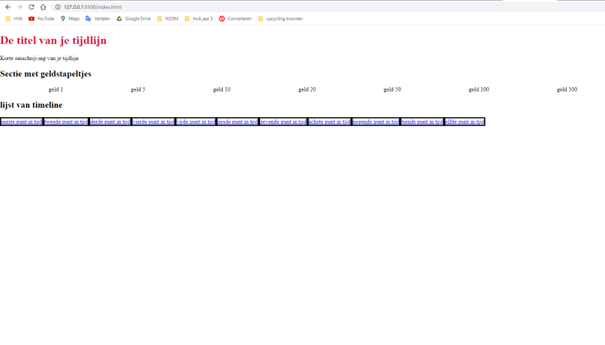

  ### Bevinding 3:
  Nadat de opzet globaal was gelukt, liep ik eigenlijk gelijk al tegen andere problemen aan. Zo wilde ik horizontaal door mijn tijdlijn kunnen scrollen en het ontwerp moest in het midden komen te staan van de webpagina. Een deel van de structuur waar ik grote vraagtekens bij kreeg toen ik erover nadacht. Ik merkte überhaupt dat ik nog helemaal geen logica zag in hoe ik deze webpagina moest aanpakken waardoor ik hier eigenlijk niet verder kon. 

  #### oplossing:
  Na zelf wat geprobeerd te hebben gebeurde er eigenlijk niet zo heel veel waardoor ik wel echt hulp nodig had. Ik heb toen met Sanne gezeten die mij heeft geholpen met de scrollbar, het centreren van het hele werk en me verder opweg heeft geholpen. Nu heeft het ontwerp ook gelijk wat meer vorm en zie ik al iets meer voor me wat het uiteindelijk moet worden. Daarbij heb ik ook gelijk de tip gekregen om alles een achtergrondkleur te geven zodat het een stuk duidelijker is waar je mee bezig bent. Ik had deze opstart even nodig om daarna zelf verder te puzzelen. Toen ik met Sanne had gezeten kwam de kennis van de kleine CSS lesjes alweer naar boven waardoor het grote vraagteken boven mijn hoofd een stuk kleiner was geworden. 
  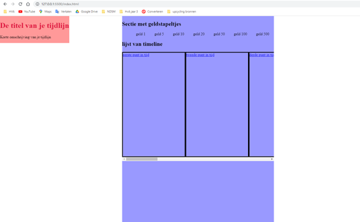

  ### Bevinding 4:
  Nu ik de structuur voor me had kon ik verder met het vormgeven van de pagina. Als eerste had ik een afbeelding nodig van Rich Uncle Pennybags die aan een tafel zit zodat het lijkt alsof je tegenover hem zit. Dit lukte met photoshop en kreeg ik daarna ook makkelijk in het ontwerp. Wel vind ik de afbeelding redelijk leeg, maar dat kan ik later nog aanvullen met bijvoorbeeld huisjes, hotels of eigendomsbewijzen die op tafel liggen.

  Het lukte me niet helemaal op de afbeelding op de juiste plek te krijgen. Zo was het groter dan het geheel en schaalde de afbeelding vreemd mee met de pagina. Op een bepaald punt kromp de afbeelding niet meer mee en verschoof een deel uit beeld. Hetzelfde gebeurde met de tijdlijn, terwijl ik de geldbriefjes wel zo had gekregen dat ze juist meeschaalde, alleen snapte ik niet helemaal waarom het bij het ene element wel lukte en bij het andere niet.

  ### oplossing:
  Voor de afbeelding probeerde ik van alles op deze passend te maken aan het oppervlak en op de juiste manier mee te laten schalen. Ik probeerde iets met de flexbox, hoogte en breedte aanpassen maar het werkte allemaal niet. Totdat ik via een andere student er achter kwam dat alles in percentages moest als je het geheel wilde laten meeschalen. Een oplossing die uiteindelijk iets makkelijker is dan gedacht en waardoor ik het meeschalen ook ineens beter begrijp. 

  ### Bevinding 5:
  Het was nu de bedoeling om de kaartjes en de geldbriefjes vorm te geven. De kaartjes kon ik doen via een lineair gradient met een harde lijn, alleen hier liep ik iets meer op vast dan gedacht. Ik wilde namelijk ook een streep tussen de kleuren hebben en niet alle vakjes moesten hetzelfde worden. Wanneer ik de tijdlijne wilde aanpassen via li:nth-of-type(1) veranderde ook
  het eerste geldstapeltje mee. Ik kwam er al snel achter waarom dit gebeurde, de geldstapeltjes had ik namelijk ook als lijst gesorteerd.

  ### oplossing:
  Voor de lineair gradient met een lijn ertussen kwam ik er wel redelijk snel achter dat ik de gradient met 3 kleuren moest maken. Dit moest met percentages zodat de kleuren altijd dezelfde grote van het vakje zouden zijn. HEt probleem dat ook de geldstapeltjes mee veranderde heb ik opgelost door alle tijdlijnvakjes in een aparte class te zetten zodat ik deze individueel kan aanspreken in de CSS.
  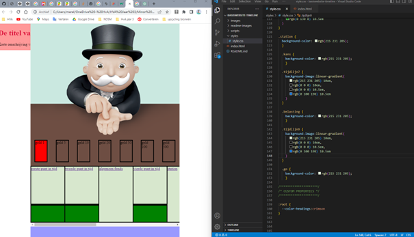

  ### Bevinding 6:
  Nu ik de kaartjes had wilde ik verder met de geldstapeltjes. Deze had ik ook allemaal in een aparte class gezet zodat ik ze apart van elkaar kon aanspreken. Het enige probleem waar ik bij de geldstapeltjes tegenaan liep is dat er een cirkel in elk stapeltje moest staan en dat de tekst eigenlijk een kwart gedraaid moest worden. 
  
  ### oplossing:
  Voor de cirkels in alle geldstapeltjes heb ik opgezocht hoe ik een cirkel in een vierkant in CSS kreeg. Hier kwam een code uit waarvan ik 90% begrijp. Zelf had ik wel bedacht dat ik bij elke geldclass een div id="geldcirkel" moest toevoegen. Zodat wanneer ik "geldcirkel" in de CSS aansprak het gelijk bij alle geldbiljetten toegepast werd. Dit lukte allemaal waardoor ik de geldstapeltjes heb. Alleen de tekst moet nog een kwartslag gedraaid worden, alleen dit pas ik wel aan zodra ik bezig ga met fonts en tekst in het algemeen. 
  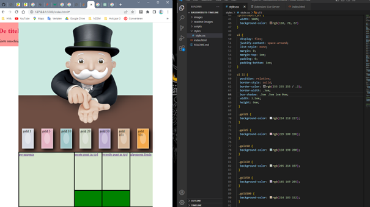
  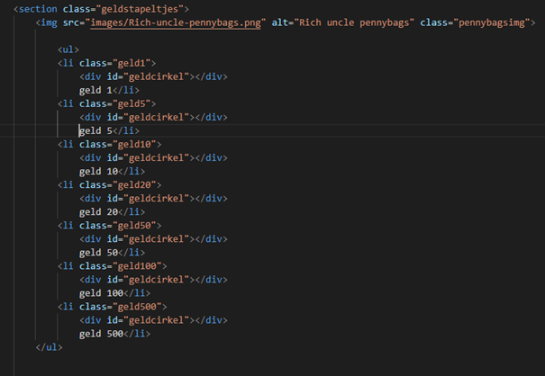

## Voortgang/Feedback 2

  
Mijn bevindingen + wijzigingen (minimaal 5)

  
  ### Bevinding 1:
  Bij de tweede feedback ronde was ik nog iets minder ver dan gehoopt. Zo had ik de vakjes met informatie nog niet en eigenlijk alleen nog een basis van de vormgeving die ik wilde hebben. Ik kreeg wel als commaentaar dat ik goed op weg was en ook nog leuke ideeën en inspiratie om toe te passen. Bijvoorbeeld opmerkingen over dat ik de achtergrond wazig kon maken als het informatievakje zichtbaar was, of dat er een animatie in de afbeeldingen van de knoppen kan zitten. 

  De feedback over mijn code vond ik heel waardevol. Zelf wist ik dat het nog redelijk een zooitje was en ik heb wel tips gekregen om dit te verbeteren. Zo kon ik de algemene styling en de custom properties beter bovenaan zetten zodat je er gelijk bij kon. Ook kreeg ik als tip om wel voldoende witruimte over te houden omdat het misschien wel snel wat druk kan worden met mijn tijdlijn.

  #### oplossing:
  Ik heb de tips over het netter maken van de code meegenomen en gelijk toegepast zodat het overzichtelijker zou worden. Verder heb ik de overige feedback opgeschreven zodat ik deze bij mij kon houden wanneer ik de informatievakjes ging maken.

  ### Bevinding 2:
  De volgende stap waren de informatievakjes. Dit vond ik wel heel lastig om mee te beginnen aangezien ik Javascript heel moeilijk te begrijpen vind. Ik liep tegen het probleem aan dat het vakje eerst ontzichtbaar moest zijn en pas zichtbaar als deze zou verschijnen. 

  #### oplossing:
  Ik ben wel begonnen met het maken van de vakjes. Dus de vormgeving van de kaartjes en dan zou ik later wel het stukje Javascript toepassen. Hier heb ik samen met Sanne aan gezeten en heeft hij mij 1 op 1 uitgelegd hoe een dialog werkt. Het eerste tijdlijnvakje heeft hij uitgeschreven, waarna ik de rest van de vakjes zelf kon doen. 
  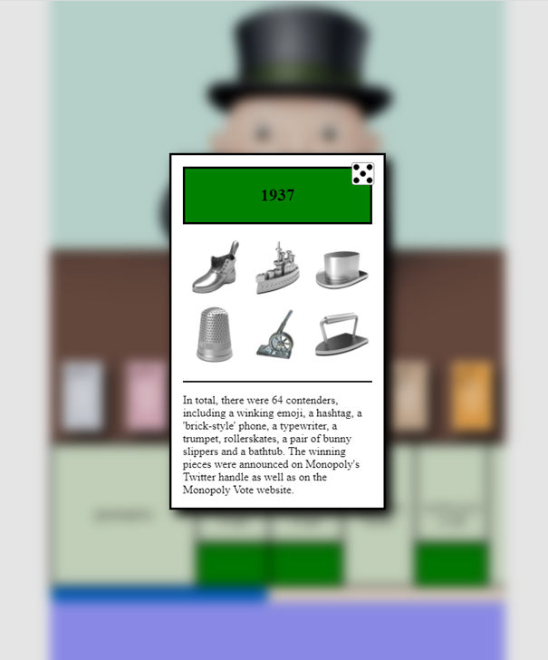

  ### Bevinding 3:
  Mijn informatievakjes moesten verschillende foto's bevatten omdat ik ze later misschien nog wil kunnen animeren. Nu vind ik positioneren nog wel moeilijk, zeker nu er meer en meer elementen in het ontwerp komen wilt dit niet altijd lukken. De foto's in de vakjes ging ik in een grid maken. Dit was de eerste keer dat ik een grid zou gebruiken dus hier moest ik even goed puzzelen.

  #### oplossing:
  Hoe een grid in elkaar zat vond ik wat lastig, dus om dit beter te begrijpen heb ik Google moeten gebruiken. Ik heb daarnaast het grid even op papier uitgetekend om het mezelf wat makkelijker te maken. Uiteindelijk is het me allemaal wel gelukt en snap ik ook beter hoe ik elementen kan positioneren in een grid.
    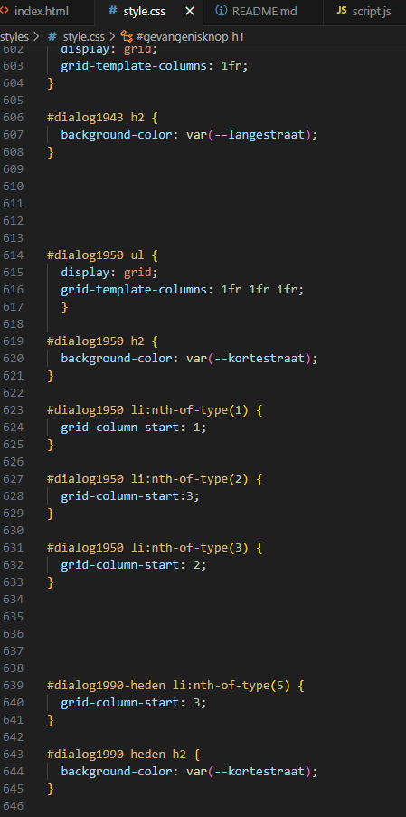

  ### Bevinding 4:
  Nu ik de basis van de vakjes had leek het mij een passend idee als je daar ook met je toetsenbord doorheen kon springen d.m.v. de pijltjestoetsen. Ik heb zitten zoeken op internet of ik dit zelf kon toepassen, maar aangezien ik Javascript tot nu toe heel moeilijk vind snapte ik hier weinig van. 

  #### oplossing:
  Uiteindelijk heb ik met Sanne gezeten om dit werkend te krijgen. Sanne heeft de code getypt maar met de uitleg die ik daarbij kreeg begrijp ik wel redelijk hoe de code in elkaar zit. 

  ### Bevinding 5:
  Nu ik de kaartjes grotendeels ook had leek het mij leuk om te kijken of ik de gevangenis kon uitwerken. Ik wilde dat er een animatie ging afspelen dat er tralies naar beneden zou vallen en dat je d.m.v. een kanskaart de gevangenis weer kon verlaten. Ik kwam hier tegen meerdere problemen aan. De animatie zelf ging eerst ook niet helemaal goed, en ik had het probleem dat alles achter de sectie niet meer aanklikbaar was wanneer de gevangenis ontzichtbaar was, er zat natuurlijk een element voor. 

  #### oplossing:
  De animatie heb ik gemaakt met keyframes en gezorgd dat de animatie gepauzeerd zou zijn. Daarbij is de gevangenis eerst buiten het beeld waardoor de knoppen eronder wel weer aanklikbaar zijn. Deze heb ik gelinkt aan de gevangenisknop zodat de animatie zou beginnen met afspelen. 
    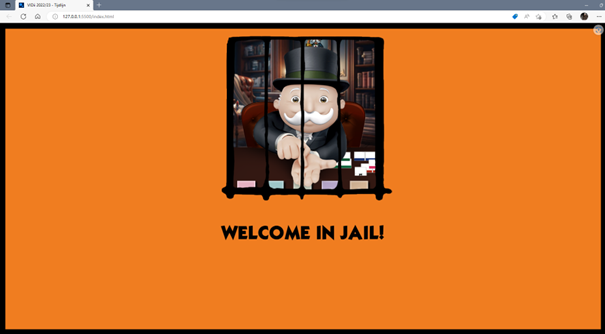
    

  ### Bevinding 6:
  De volgende stap was om ook weer de gevangenis uit te kunnen. Dit was wat moeilijker aangezien ik al snel had dat de sectie ontzichtbaar was maar nog steeds wel boven alle andere secties stond. Ook wilde ik dit met een kanskaart als button doen die zou omdraaien wanneer je over de kaart hovert.

  #### oplossing:
  De oplossing van het kaartje heb ik via een code op internet gedaan en die vormgegeven naar het ontwerp. Dit werkte eigenlijk al erg goed, zelf heb ik er nog de animatie aan toegevoegd dat het kaartje ook omhoog gaat als je erover hovert. Het probleem dat de gevangenis boven alle andere elementen was heb ik via chatGPT opgelost. Deze heeft een Javascript code geschreven die ik kon gebruiken.
    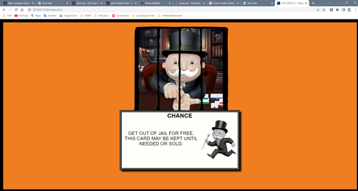
    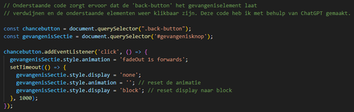

## Voortgang/Feedback 3

  
Mijn bevindingen + wijzigingen (minimaal 5)

  
  ### Bevinding 1:
  Als feedback kreeg ik terug dat het er allemaal goed uitzag. Wel was de tekst van de kaartjes erg lang waardoor sommige kaartjes gingen uitrekken, dit was storend. Ook kreeg ik als feedback om een achtergrond bij het geheel toe te voegen om zo de lege ruimte op te vullen. Wel moet deze niet te druk zijn en passend bij de gehele vorm. Daarnaast was de afbeelding van Rich Uncle Pennybags nog was leeg en saai.

  De laatste feeedback die ik kreeg was over de afbeeldingen van de tijdlijn. Deze staan expres op zijn kop zodat het zou lijken alsof je met Rich Uncle Pennybags een potje Monopoly aan het spelen bent. Dit heb ik even omgedraaid, maar vond ik er zelf wat raar uitzien. Ik snap waar de feedback vandaan komt, maar dan had ik ook veel knoppen om moeten draaien en anders moeten linken waardoor ik het gelaten heb zoals het is.

  #### oplossing:
  Ik heb de feedback verwerkt en zowel de afbeelding aangepast als een achtergrond toegevoegd. Ook heb ik toegevoegd dat je nu door de informatievakjes kan scrollen. Hierbij is de scrollbar in hetzelfde thema als de scrollbar van de gehele tijdlijn.
  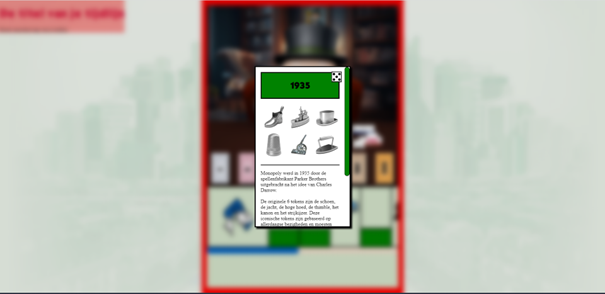
  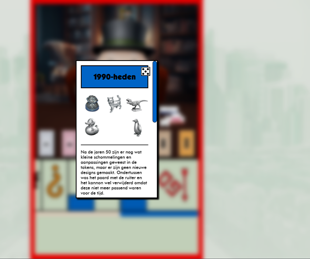

  ### Bevinding 2:
  Ik ging verder met de elementen als de fonts, en de effecten op hovers en het tab knopje. Ik wilde dezelfde fonts gebruiken als Monopoly en daarnaast wilde ik dat het leek alsof het knopje van de tijdlijn echt ingedrukt werd.

  #### oplossing:
  De fonts waren gelukkig gratis te downloaden en kon ik via fonts squirrel juist omzetten zodat ik deze in mijn code kon gebruiken. Hiervoor heb ik de code van de presentatie gebruikt en zelf ingevuld. De fonts werken en erachter heb ik een alternatieve font gekozen die standaard voor elke browser is.
  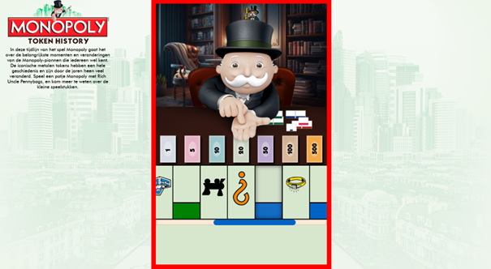

  

## Reflectie

  
Mijn eindresultaat & persoonlijke ontwikkeling

  ### Je uitkomst - karakteristiek screenshot(s):
  
  
  
  
  
  
  

  ### Dit ging goed/Heb ik geleerd: 
  Ik heb veel geleerd over coderen, zeker omdat ik hier nog helemaal geen ervaring mee had. Wat voor mezelf goed ging is het gevangenisvakje. De animatie en het kaartje heb ik bijna helemaal zelf (met wat internet hulp) kunnen coderen en vond ik een leuke toevoeging voor de tijdlijn. Verder heb ik voor mijn idee het positioneren van de elementen goed onder de knie terwijl ik dit eerst erg lastig vond. Nu heb ik in mijn ontwerp ook veel verschillende opties voor het positioneren van elementen gebruikt waardoor ik het allemaal wel tegen kwam.

  Ik merkte vooral dat CSS het onderdeel van coderen was dat ik het leukste vond en wat ook wel goed ging. Zo zag ik de vele mogelijkheden van CSS en hoe je elementen naar je eigen hand kan zetten.

  Verder gingen de losstaande codes het makkelijkste. Ik vond codes die op elkaar inspeelde wat moeilijk om te begrijpen. Zo heb ik gekozen voor een responsive design maar het werken met max width en percentages vond ik, vooral in het begin, redelijk lastig. Maar de kleine elementen die leuk zijn voor het design gingen erg goed. Zoals de cursors aanpassen, de geldstapeltjes of de passende Monopoly fonts invoeren.

  Het volgende wat goed ging was het animeren met keyframes. Dit onderdeel vond ik ook zeker leuk en heb ik op twee momenten in mijn tijdlijn gebruikt. Ik wilde meer animaties in mijn tijdlijn kwijt, maar door tijdsgebrek ben ik hier helaas niet aan toegekomen.

  Als laatste heb ik ook veel geleerd over hoe belangrijk het is om je code netjes te houden. Ik ben van mezelf niet heel gestructureerd, dus hier heb ik wel mijn best op moeten doen. Zeker toen de code langer werd raakte ik ook zeker in de knoop waardoor in gelijk meer structuur in de code heb toegepast. Ik denk wel dat mijn HTML code wat netter kan, maar ik vind HTML ook nog wel een lastig onderdeel om goed te begrijpen.  

  ### Dit was lastig/Is niet gelukt:
  Ondanks dat ik het erg leuk vond om te leren coderen, ging niet alles helemaal goed. Ik heb daardoor best wat leuke ideeën moeten laten vallen wegens tijdgebrek. 

  Javascript was een onderdeel dat ik heel moeilijk vond. Ik heb het wel veel geprobeerd, maar daar mislukte ook erg veel van. Hierdoor heb ik het Javascript onderdeel niet heel uitgebreid gedaan en de interactie redelijk simpel gehouden.

  Ik heb redelijk wat moeite gehad met het maken van het flip kanskaartje van de gevangenis. Daardoor heb ik de Javascript code ook niet zelf geschreven, maar wel zelf de vormgeving gedaan. Ik wilde deze functie ook gebruiken voor de algemeen fonds vakjes, en de kansvakjes op de tijdlijn. Maar ik was al zo lang bezig met het flip kaartje dat ik hier helaas geen tijd meer voor had, dus die vakjes hebben momenteel nog geen functie.

  Verdere ideeën die ik helaas niet heb kunnen uitwerken is het GO! vakje. Hier wilde ik ook met animaties werken dat het leek alsof je Monopoly-geld kreeg. Ook wilde ik graag Rich Uncle Pennybags met een tekstwolkje iets laten zeggen wanneer je met de muis over zijn geld zou hoveren. Dit waren leuke elementen om toe te passen maar wat me helaas niet is gelukt.

## Bronnenlijst

continu bijhouden terwijl je werkt

Nb. Wees specifiek ('css-tricks' als bron is bijv. niet specifiek genoeg).

1. Monopoly man ahtergrond: https://www.pngkit.com/view/u2e6q8i1t4u2o0w7_monopoly-man-running-monopoly-man-pay-me/
2. Monopoly-tokens en informatie: https://coolmaterial.com/home/games/the-story-behind-monopoly-pieces/
3. Handboeien cursors: https://www.freepik.com/free-vector/metal-handcuffs-realistic-set_26763790.htm#query=handcuffs%20open&position=2&from_view=search&track=ais
4. Hoge hoed cursor: https://www.pinpng.com/download/iowiho_monopoly-game-pieces-png-transparent-png/
5. Achtergrond van het kantoor: https://www.freepik.com/

6. Code voor de flip kanskaart button: https://codepen.io/diegotorres/pen/WxaxKo
7. Code ook gebruikt voor de flip kanskaart button: https://www.w3schools.com/howto/howto_css_flip_card.asp
8. ChatGPT voor de code om het gevangenisvakje te laten verwijderen.
9. Craiyon AI voor de hond en het schilderij in de achtergrond afbeelding.

