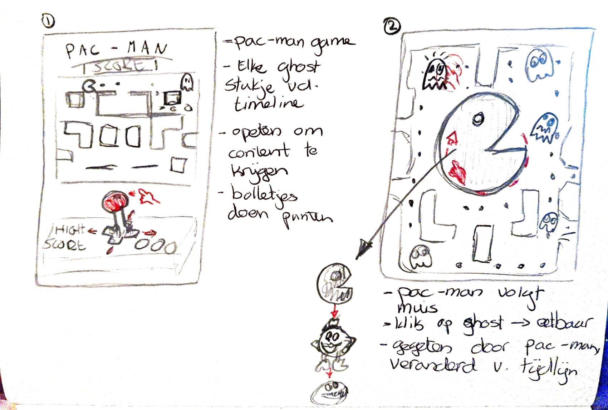

# Procesverslag
Markdown is een simpele manier om HTML te schrijven.  
Markdown cheat cheet: [Hulp bij het schrijven van Markdown](https://github.com/adam-p/markdown-here/wiki/Markdown-Cheatsheet).

Nb. De standaardstructuur en de spartaanse opmaak van de README.md zijn helemaal prima. Het gaat om de inhoud van je procesverslag. Besteedt de tijd voor pracht en praal aan je website.

Nb. Door *open* toe te voegen aan een *details* element kun je deze standaard open zetten. Fijn om dat steeds voor de relevante stuk(ken) te doen.

## Jij

### Ontwerper:
Merel Timmer

#### Je startniveau:
Mijn startniveau is: blauw

# Je plan

  
De eerste versie/schets van je ontwerp & je persoonlijke uitdaging

  ### De eerste versie/schets:
  
   

  Ik wilde liever een eigen karakter kiezen dan één van de voorgestelde karakters uit de eerste les om zo de tijdlijn echt een eigen werk te maken. Juist het bedenken van concepten vind ik erg leuk waardoor ik graag de vrijheid hiervan wilde gebruiken. Tijdens de eerste les was ik aan het brainstormen over PAC-MAN waar ik al een leuk idee voor had bedacht. Maar toen ik richting huis ging liep ik even snel de Intertoys in om te kijken of ik daar wat iconische karakters tegen zou komen. Zo kwam ik Rich Uncle Pennybags tegen, oftewel de 'Monopoly guy'. Monopoly is een spel wat ik heel graag speel en zelfs meerdere versies van in huis heb liggen. Ik ben verder gaan brainstormen over dit karakter en heb er meerdere schetsen voor gemaakt. Uiteindelijk heb ik gekozen voor een ontwerp waardoor het lijkt alsof je een potje Monopoly tegen Rich Uncle Pennybags speelt, en waar de straten van het speelbord de uiteindelijke tijdlijn is.

  ### Je ambitie: 
  Aan deze technieken/punten wil ik werken:
  - Het begrijpen van coderen in het algemeen.
  - Werken aan mijn netheid en leesbaarheid van code.
  - Werken met interactie en animatie in code.
  - Kunnen begrijpen hoe code met elkaar samenwerkt.
 

## Voortgang/Feedback 1

  
Mijn bevindingen + wijzigingen (minimaal 5)

  ### Bevinding 1:
  Het opstarten ging een beetje moeizaam aangezien ik niet goed wist waar ik moest beginnen. Zo vond ik het lastig om te bepalen welke elementen ik allemaal nodig had en waar dat moest komen te staan in de HTML. Ik vind het ook moeilijk om het ontwerp voor me te zien als ik alleen nog maar een wit vlak op mijn beeldscherm heb.

  #### oplossing:
  Beschrijving hoe je het hebt hebt opgelost of als het niet gelukt is hoe je het zou oplossen (tekst en afbeeding(en)).

  ### Bevinding 2:
  Omschrijving van wat er nog niet orde was (tekst en afbeeding(en)).

  #### oplossing:
  Beschrijving hoe je het hebt hebt opgelost of als het niet gelukt is hoe je het zou oplossen (tekst en afbeeding(en)).

  ### Bevinding 3:
  ...

## Voortgang/Feedback 2

  
Mijn bevindingen + wijzigingen (minimaal 5)

  
  ### Bevinding 1:
  Omschrijving van wat er nog niet orde was (tekst en afbeeding(en)).

  #### oplossing:
  Beschrijving hoe je het hebt hebt opgelost of als het niet gelukt is hoe je het zou oplossen (tekst en afbeeding(en)).

  ### Bevinding 2:
  Omschrijving van wat er nog niet orde was (tekst en afbeeding(en)).

  #### oplossing:
  Beschrijving hoe je het hebt hebt opgelost of als het niet gelukt is hoe je het zou oplossen (tekst en afbeeding(en)).

  ### Bevinding 3:
  ...

## Voortgang/Feedback 3

  
Mijn bevindingen + wijzigingen (minimaal 5)

  
  ### Bevinding 1:
  Omschrijving van wat er nog niet orde was (tekst en afbeeding(en)).

  #### oplossing:
  Beschrijving hoe je het hebt hebt opgelost of als het niet gelukt is hoe je het zou oplossen (tekst en afbeeding(en)).

  ### Bevinding 2:
  Omschrijving van wat er nog niet orde was (tekst en afbeeding(en)).

  #### oplossing:
  Beschrijving hoe je het hebt hebt opgelost of als het niet gelukt is hoe je het zou oplossen (tekst en afbeeding(en)).

  ### Bevinding 3:
  ...

## Reflectie

  
Mijn eindresultaat & persoonlijke ontwikkeling

  ### Je uitkomst - karakteristiek screenshot(s):
  

  ### Dit ging goed/Heb ik geleerd: 
  Korte omschrijving met plaatje(s)

  

  ### Dit was lastig/Is niet gelukt:
  Korte omschrijving met plaatje(s)

  

## Bronnenlijst

continu bijhouden terwijl je werkt

Nb. Wees specifiek ('css-tricks' als bron is bijv. niet specifiek genoeg).

1. bron 1
2. bron 2
3. ...

